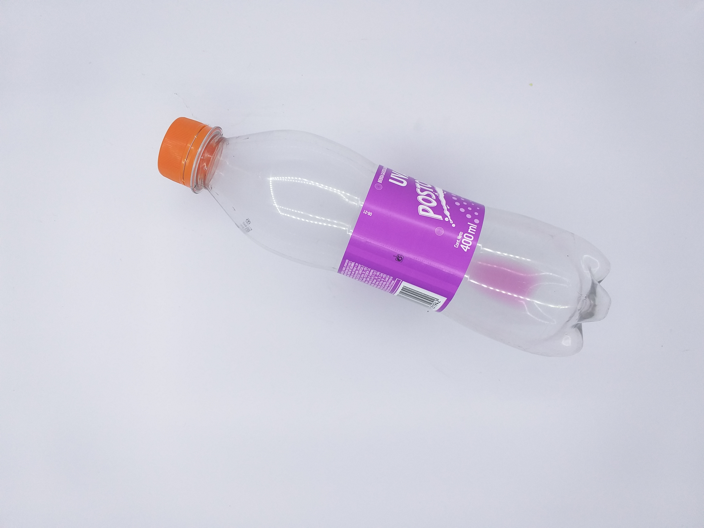
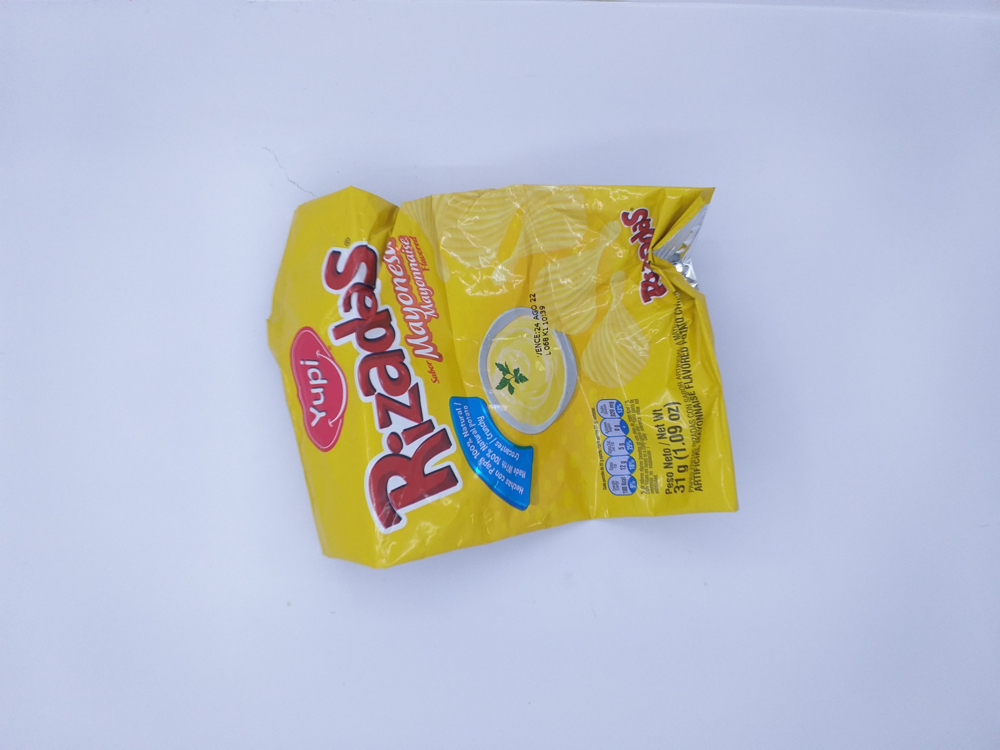

# Automatic sorting of usable and non usable waste at the Pontificia Universidad Javeriana Cali using DeepLearning 
Degree work for the degree of Electronic Engineer.

## By: 
  - *Juan Esteban Torres Tamayo*
  - *Janner Arley Rosero Mora*
 
## Thesis Director:
  - *PhD. Hernán Dario Vargas Cardona*

## Models:
In this project we have used 6 models of architectures, each model has been applied with Transfer Learning methods. The models are as follows:

- InceptionV1 '<Fine Tuning>'
- ResNet50V2 '<Fine Tuning>'
- MobileNetV3 '<Fine Tuning>'
- MobileNetV3 + SVM '<Feature extractor>'
- VGG19 '<Fine Tuning>'
- VGG19 + SVM '<Feature extractor>'

## Dataset:
This dataset contains a total of 2015 photos (1015 of usable and 1000 of non-usable waste). Within this photos you can find food packaging, plastic and glass bottles, napkins, batteries, among others.

An example of photos of usable and non-usable waste is shown below:

### Usable

### Non-usable

Dataset available in the following link: https://drive.google.com/drive/folders/1Juy3mwwbKxS25jGUhr4gWGNkdIkjnA0d?usp=share_link
